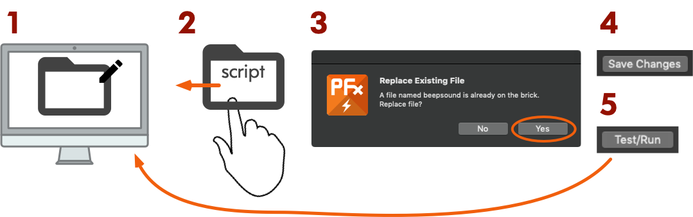

# PFx Brick scripting for Visual Studio Code 


This repository contains a language support extension to Visual Studio Code for the [PFx Brick](https://www.fxbricks.com/pfxbrick) scripting language.

The PFx Brick scripting language is based on a very simple syntax. Script files are plain text files with the `.pfx` file extension.

## Syntax Highlighting

This extension provides convenient syntax highlighting for working with PFx Brick script files.


## Installation

Copy the PFx Brick extension to the VSCode extension directory:

- **Windows**: `%USERPROFILE%\.vscode\extensions`
- **macOS/Linux**: `$HOME/.vscode/extensions`

```shell
    $ git clone https://github.com/fxbricks/pfx-brick-vscode.git
    $ cp -R pfx-brick-vscode/ ~/.vscode/extensions/ldraw-vscode
```

Restart VSCode and the extension should run automatically everytime you open a file with `.pfx` file extension.

## Scripting Actions

As of ICD version 3.37 (and PFx Brick firmware versions 1.40+), the ability to execute complex actions and behaviours defined in script files was added. Script files are simple, human readable text files stored in the PFx Brick file system. These files conform to a simple script language syntax described later in this document. The scripting capability can be summarized as follows:

1. Scripts are ASCII text files stored in the PFx Brick file system.
2. Scripts execute one at a time. Executing another script will terminate the current script and
start the new one.
3. Scripts can be executed either by using an Event/Action (with the `COMMAND` byte) or with the
ICD message `PFX_CMD_RUN_SCRIPT`.
4. Script execution is sequential line-by-line from the start of the file to the end. At the end, the
script will either stop or repeat if a repeat command is the last line.
5. Script lines with bad syntax are ignored and script execution will continue to the next line.

## Loading Scripts

Script files can be loaded on to the PFx Brick using the PFx App or by using other 3rd party software to copy files from a host PC to the PFx Brick. 

Creating script files or making changes to a script must be made on a host PC using any standard text editor (e.g. Windows Notepad, macOS Text Editor, and of course VS Code) To modify a script file, the old one must be removed from the PFx Brick file system and then replaced with a new copy (with the same file ID).

This PFx App update makes the process of quickly testing script files easier by letting you run/stop scripts directly from the PFx App.  To run a script, simply click a recognized script file, and click the `Test/Run` button. Note that the script file must already be copied to the PFx Brick (the PFx circle indicator on the right column should be filled).  You can stop a running script file by pressing the `Stop` button or simply let it continue to run.


To speed up the iteration of debugging and testing new scripts, you can follow this 4 step process repeatedly for each iteration of your script file:



## Script Syntax

The PFx Brick script language syntax is a simple human readable free form text file format. Script files can contain comments and arbitrary amounts of whitespace in addition to the recognized script keywords. Script file execution is sequential and proceeds line by line from the start of the file to the end. This implies that all logical script commands must be terminated with a either a linefeed (`0x0A`) and/or carriage return character (`0x0D`).

### Comments

Comment lines start with either a `#` character (similar to python) or `//` characters (similar to C++). Comments should not be used in line with a command.

~~~
# Valid comment
// Another valid comment
light 1 on  # not a valid comment location
~~~

### Keywords

The script syntax uses case sensitive keyword commands and specifiers.  There are several primary keywords which act as commands and many secondary keywords used for specifying sub-commands, parameters values and options.

The primary keyword commands are as follows:

~~~
light <channels> <commands>
motor <channels> <commands>
sound <commands>
ir <parameters>
wait <parameters>
repeat
run
stop
~~~

The secondary command and parameter keywords are as follows:

~~~
play, fade, all, on, off, flash, loop, left, right, up, down,
ch, speed, fx, vol, bass, treble, bright, joy, beep, button
~~~

### Numeric Values

Many commands and options require specified numeric quantities.  The script syntax supports both integer and decimal values.  The following are examples of valid numeric quantities:

~~~
0 127 -55 0.010 35.75 -90.5
~~~

Additionally, integer values may be specified in hexadecimal (base16) prefixed with the characters `0x`.

~~~
0x0 0xABCD 0x32
~~~


For commands which support a list of values, a list is specified as a group of comma separated numbers enclosed in matching square brackets:

~~~
[0, 1, 2, 3]
~~~

### Strings

Some commands also support the use of strings--typically for specifying items such as filenames.  Strings are UTF-8 formatted and enclosed within double quotations marks (`"`).

~~~
"This is a string"
~~~

### Light Commands

~~~
light <channels> <commands>
~~~

`channels` can be specified as a single channel number 1-8, a list of channels enclosed with
[] parenthesis, or the keyword all
commands are a combination of the following keywords and values: 

- `on` - turn on light channel(s)
- `off` - turn off light channel(s)
- `fade <time>` - fade time (0 to 10.0 seconds)
- `flash <ontime>[offtime]` - periodic flashing light (0.05 to 60.0 seconds)
- `bright <value>` - set brightness (0 to 255)
- `fx <id> [parameters]` - performs light `action <id>` as `LIGHT_FX_ID` with specified parameters if `channels` = `all` then `<id>` is a combo id

**Examples:**

~~~
light 1 on
light [1,4,8] off fade 0.5
light [2,4] flash 0.1 0.4 fade 0.1
light all bright 128
light [6,7] fx 0x0C [1,0,3,0,0]
~~~

### Sound Commands

~~~
sound <command>
~~~

`command` is one of the following keywords:
- `play fileID` - start playback of fileID
- `stop fileID` - stop playback of fileID
- `play fileID repeat` - continuous playback of fileID 
- `play fileID loop <value>` - plays fileID for value times 
- `vol <value>` - set volume (0 to 255)
- `bass <value>` - set bass (-20 to 20)
- `beep` - short beep sound
- `treble <value>` - set treble (-20 to 20)
- `fx fileID <id>[parameters]` - performs sound action <id> as `SOUND_FX_ID` with specified parameters

`fileID` can be specified either as a numeric file ID or string containing the filename.

**Examples:**

~~~
sound play 3 loop 5 
sound play "Siren1.wav" 
sound vol 160
sound treble -6
sound fx 9 0x04 0 0
~~~

### Motor Commands

~~~
motor <channels> <command>
~~~

`channels` can be specified as a single channel number 1 or 2 (or as a and b), a list of channels enclosed with [] parenthesis, or the keyword `all`

`command` is one of the following keywords:
- `stop` - stop motor channel(s)
- `speed <value>` - motor speed (-255 to 255), +speed is forward, -speed is reverse direction
- `servo <value>` - servo motor angle (-90 to 90)
- `fx <id> [parameters]` - performs motor `action <id>` as `MOTOR_FX_ID` with specified parameters

**Examples:**

~~~
motor all stop
motor a speed -50
motor 2 servo 45 
motor 1 fx 0x07 0x03 0
~~~

### IR Commands

- `ir on` - activates the IR sensor
- `ir off` - disables the IR sensor

### Execution Control

Delay execution and wait for event to resume:

- `wait <time>` - pause (0.05 to unlimited sec)
- `wait sound fileID` - pause execution until sound file `fileID` has stopped playing
- `wait ir <parameters>` - pause execution until IR event has been received

where `parameters` can be any combination of:

- `joy` - joystick remote, 
- `speed` - speed remote, 
- `up, down, left, right, button` - remote actions 
- `ch <value>` - IR channel

Redirect execution to same or different script:

- `repeat` - repeat execution of current script 
- `run fileID` - execute script with fileID
- `stop` - stops the script at the current line

**Examples:**

~~~
wait 3.0
wait sound 5
wait ir joy left up
wait ir speed ch 4 left button stop
run 3
run "MyScript.txt"
~~~

## Sample Scripts

```python
# Traffic light sequence
#
# Ch 1: Red, Ch 2: Yellow, Ch 3: Green 
# Ch 4: Don't Walk, Ch 5: Walk

# reset all light channels
light all off

# Red phase
light [1,4] on
light [2,3,5] off fade 0.2 
wait 8.0

# Green phase
light [1,4] off fade 0.2
light [3,5] on
wait 8.0

# Pedestrian crossing warning 
light 5 off fade 0.1
light 4 flash 0.4 fade 0.1 
wait 5

# Yellow
light 3 off fade 0.2 
light [2,4] on
wait 4

# Start the sequence again 
repeat
```

```python
# Motorized musical procession
#
# Vehicle with motor, lights and music; Triggered by IR remote

# Start with everything off
light all off
sound stop all 
motor all off

# Wait for joystick remote ch 1 right up
wait ir joy ch 1 right up

# Play sound and move
motor a speed 30
light all on
sound play "MySong.wav"

# Wait until song is finished, stop and repeat
wait sound "MySong.wav" 
motor a stop
repeat
```


## References

* [PFx Brick Interface Control Document (ICD) v.3.37](https://github.com/fx-bricks/pfx-brick-dev/raw/master/doc/ICD/PFxBrickICD-Rev3.37.pdf) describes details of PFx Brick operation and communication protocol

* [brickelectronic.de](http://brickelectronic.de) has kindly contributed a custom [PFx language profile for Notepad++](https://github.com/Brickelectronic/pfxbrick_notepadplusplus) available from their Github repository.

If you want to learn more about PFx Brick, check out [our website](https://fxbricks.com/pfxbrick).
